# 📑 Relatório de Avaliação por Inspeção de Interface: Rudiá

## 🏠 Parte 1: Home Page (Página Inicial)

### 📍 Sessão Hero

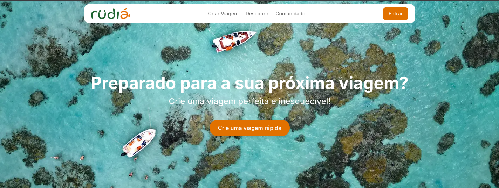

| ID      | Descrição do Problema                                          | Localização                          | Sugestão de Melhoria                                                  | Gravidade | Esforço |
| :------ | :------------------------------------------------------------- | :----------------------------------- | :-------------------------------------------------------------------- | :-------- | :------ |
| **7.1** | Baixo contraste entre texto branco e imagem clara (FM11, AC4). | Título principal da Hero.            | Aplicar um _overlay_ escurecido na imagem ou _text-shadow_ no título. | Alta      | Leve    |
| **7.2** | Falta de texto alternativo em imagem complexa (AC1).           | Imagem de fundo da Hero.             | Adicionar atributo `alt` descritivo da "viagem paradisíaca".          | Média     | Leve    |
| **7.3** | Conflito de hierarquia entre botões (FM2).                     | Botões "Entrar" e "Crie uma viagem". | Reduzir o peso visual do botão "Entrar" (usar apenas contorno).       | Média     | Leve    |
| **7.4** | Ambiguidade no termo "Viagem rápida" (CO1, CO3).               | Botão de CTA central.                | Alterar para "Começar Roteiro Agora" para melhorar a _affordance_.    | Baixa     | Leve    |
| **7.5** | Ausência de indicador de foco no menu (AC9, AC2).              | Links do cabeçalho flutuante.        | Garantir que o estado `:focus` seja visualmente distinto.             | Alta      | Leve    |

### 📍 Roteiros da Comunidade e Lugares Famosos

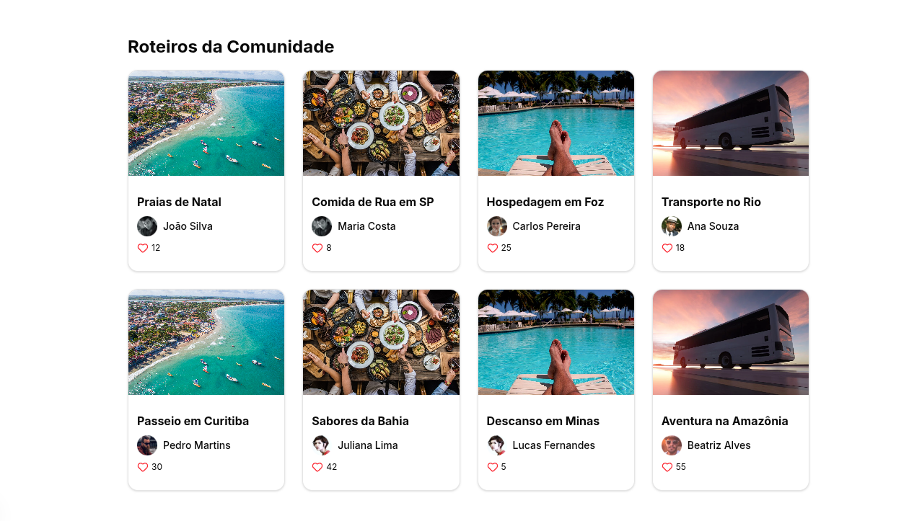
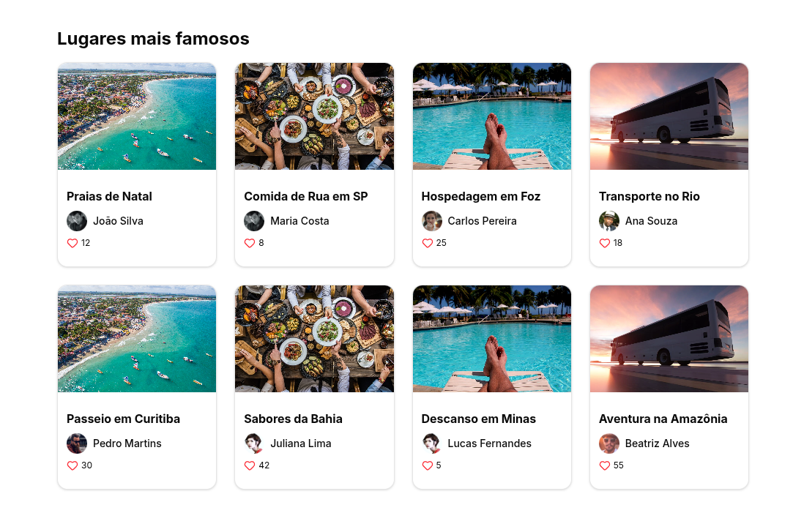

| ID      | Descrição do Problema                                | Localização                               | Sugestão de Melhoria                                                   | Gravidade | Esforço  |
| :------ | :--------------------------------------------------- | :---------------------------------------- | :--------------------------------------------------------------------- | :-------- | :------- |
| **8.1** | Falsa interatividade/Falso positivo (CO3, AF1).      | Cards que se movem mas não executam ação. | Remover animação de _hover_ e cursor 'pointer' enquanto inativo.       | Alta      | Leve     |
| **8.2** | Quebra de consistência interna de componentes (FM6). | Cards da Home vs Fluxo de Roteiro.        | Padronizar: se visualmente é um card de item, deve ser clicável.       | Média     | Moderado |
| **8.3** | Microinteração de "curtida" sem feedback (CO2, AC9). | Ícone de coração nos cards.               | Implementar mudança de cor (vermelho) e incremento numérico ao clicar. | Média     | Leve     |
| **8.4** | Seção meramente decorativa sem exploração (PU5).     | Roteiros da Comunidade.                   | Vincular os perfis e cards a páginas de detalhes dos roteiros.         | Média     | Grande   |

### 📍 Banner de Cadastro e Rodapé

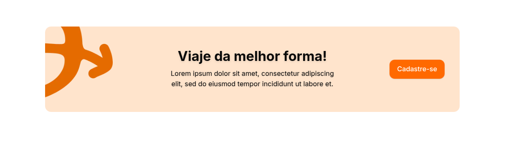
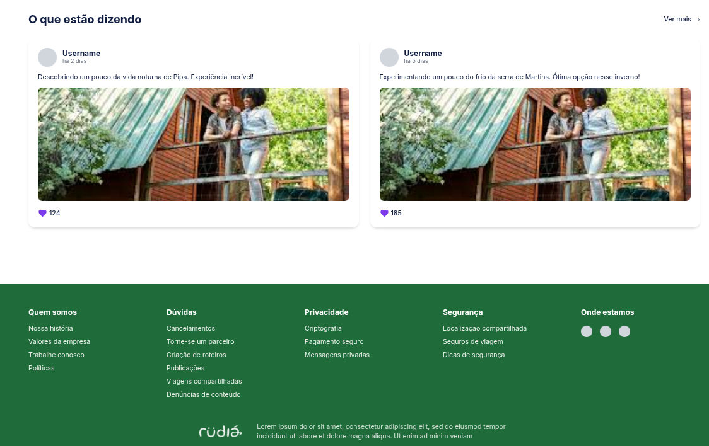

| ID       | Descrição do Problema                                  | Localização                        | Sugestão de Melhoria                                                  | Gravidade | Esforço  |
| :------- | :----------------------------------------------------- | :--------------------------------- | :-------------------------------------------------------------------- | :-------- | :------- |
| **9.1**  | Botão de conversão inativo (AF1, CO3).                 | Botão "Cadastre-se".               | Vincular à rota de registro ou abrir modal de cadastro.               | Alta      | Leve     |
| **9.2**  | Uso de texto _placeholder_ (Lorem Ipsum) (CO6).        | Descrição do banner de cadastro.   | Substituir por texto real que venda o valor da plataforma.            | Média     | Leve     |
| **9.3**  | Espaçamento visual e vazio na composição (FM2).        | Alinhamento de texto e botão.      | Centralizar ambos para manter o foco do olhar do usuário.             | Baixa     | Leve     |
| **10.1** | Links estáticos em áreas de navegação (AF1, NA5).      | Link "Ver mais" e links do rodapé. | Implementar redirecionamentos para as páginas citadas.                | Alta      | Moderado |
| **10.2** | Falha de transparência em seções sensíveis (PS2, CO6). | Textos de Privacidade e Segurança. | Substituir textos genéricos por políticas reais de proteção de dados. | Alta      | Leve     |
| **10.3** | Ícones sociais vazios e sem identificação (AC1, FM4).  | Seção "Onde estamos" no Footer.    | Inserir logotipos das redes e atributos `aria-label`.                 | Média     | Leve     |

---

## 🔑 Parte 2: Acesso ao Sistema (Login)

### 📍 Tela de Login

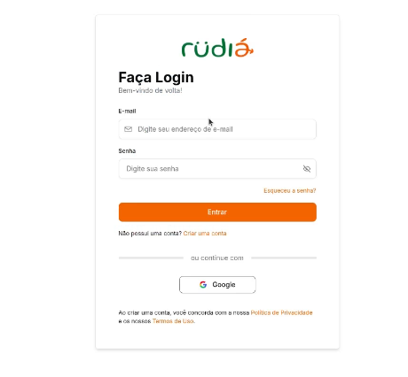

| ID       | Descrição do Problema                             | Localização                                           | Sugestão de Melhoria                             | Gravidade | Esforço  |
| :------- | :------------------------------------------------ | :---------------------------------------------------- | :----------------------------------------------- | :-------- | :------- |
| **L1.1** | Funcionalidades de suporte inativas (AF1).        | Link "Esqueceu a senha?".                             | Implementar o fluxo de recuperação de senha.     | Alta      | Moderado |
| **L1.2** | Botão de autenticação social sem ação (AF1, CO3). | Botão "Entrar com o Google".                          | Integrar com a API de autenticação do Google.    | Alta      | Moderado |
| **L1.3** | Falha de acesso a documentos legais (PS2, CO6).   | Links de "Política de Privacidade" e "Termos de Uso". | Redirecionar para os documentos correspondentes. | Alta      | Leve     |

---

## 🗺️ Parte 3: Fluxo de Criação de Roteiro

### 📍 Etapa 1: Planejamento Inicial

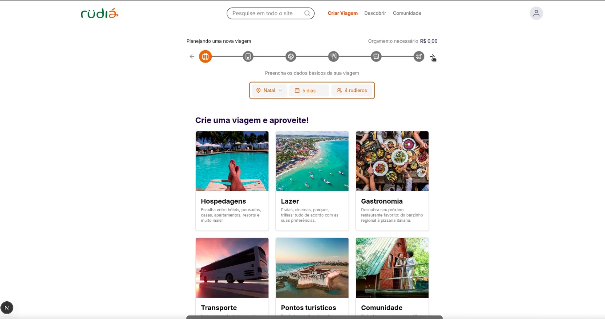

| ID      | Descrição do Problema                             | Localização                       | Sugestão de Melhoria                                         | Gravidade | Esforço |
| :------ | :------------------------------------------------ | :-------------------------------- | :----------------------------------------------------------- | :-------- | :------ |
| **1.1** | Baixo contraste em textos de suporte (FM11, AC4). | Descrição dos cards e subtítulos. | Escurecer o tom do cinza para atingir o índice 4.5:1.        | Alta      | Leve    |
| **1.2** | Falta de convite à ação (CTA) claro (CO3, CO2).   | Cards de categorias.              | Adicionar botão "Selecionar" ou efeito de _hover_ destacado. | Média     | Leve    |
| **1.3** | Área de toque reduzida (PD5).                     | Ícones da _stepper_ no topo.      | Aumentar o espaçamento e a área clicável entre ícones.       | Média     | Leve    |

### 📍 Etapa 2: Hospedagens

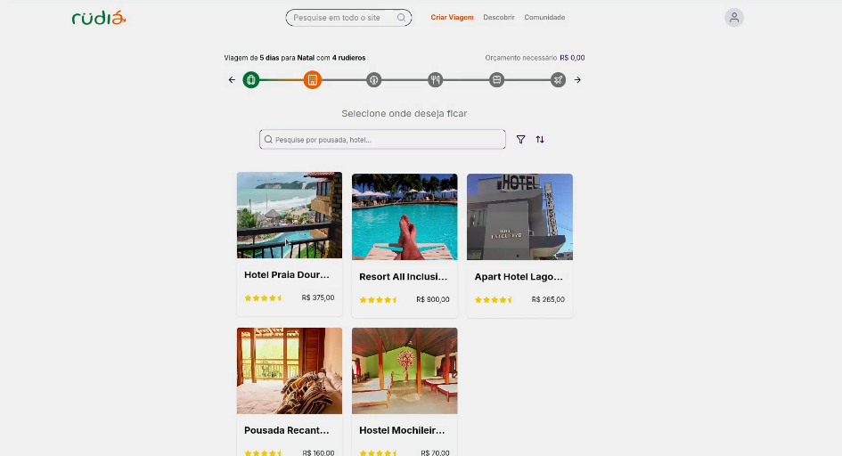
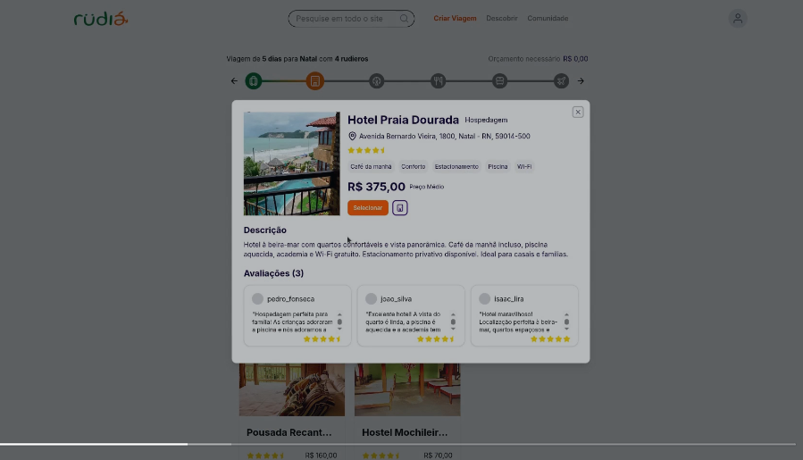

| ID      | Descrição do Problema                                  | Localização                        | Sugestão de Melhoria                                              | Gravidade | Esforço  |
| :------ | :----------------------------------------------------- | :--------------------------------- | :---------------------------------------------------------------- | :-------- | :------- |
| **2.1** | Truncamento de nomes de estabelecimentos (FM1, FM2).   | Títulos nos cards de hotéis.       | Permitir quebra de linha ou reduzir a fonte.                      | Média     | Moderado |
| **2.2** | Proximidade excessiva de botões de ação (AF9, PD5).    | Modal: "Selecionar" e "Favoritar". | Aumentar o distanciamento físico entre os botões.                 | Alta      | Leve     |
| **2.3** | Sobrecarga por múltiplas barras de rolagem (FM1, NA5). | Modal: Seção de avaliações.        | Remover scroll interno individual; usar expansão ou scroll único. | Média     | Moderado |

### 📍 Etapa 3: Lazer e Passeios

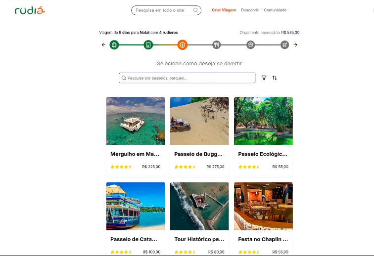

| ID      | Descrição do Problema                          | Localização                  | Sugestão de Melhoria                          | Gravidade | Esforço |
| :------ | :--------------------------------------------- | :--------------------------- | :-------------------------------------------- | :-------- | :------ |
| **3.1** | Instrução de tarefa ambígua (CO3, NA1).        | Texto de instrução da etapa. | Especificar se a seleção é única ou múltipla. | Média     | Leve    |
| **3.2** | Fluxo de navegação sem confirmação (NA5, AF9). | Final da listagem de lazer.  | Incluir botão "Confirmar e Próximo".          | Alta      | Leve    |

### 📍 Etapa 6: Salvamento e Encerramento

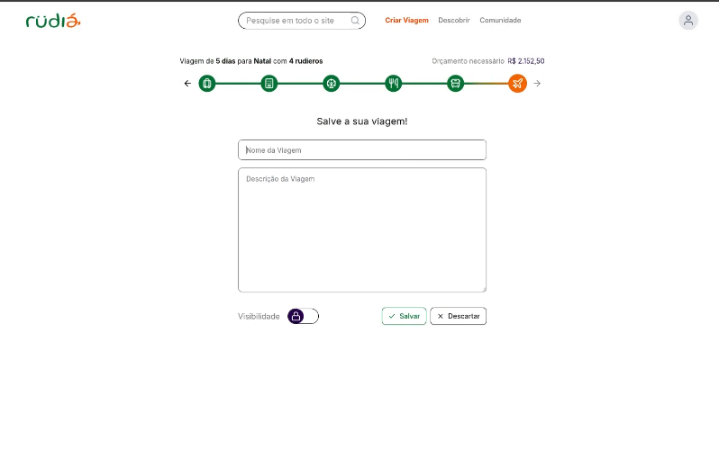
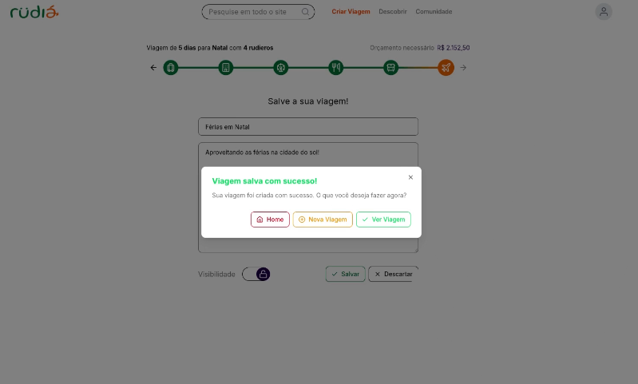

| ID      | Descrição do Problema                             | Localização                    | Sugestão de Melhoria                                         | Gravidade | Esforço |
| :------ | :------------------------------------------------ | :----------------------------- | :----------------------------------------------------------- | :-------- | :------ |
| **6.1** | Privacidade sem transparência textual (PS1, PS2). | Switch de "Visibilidade".      | Adicionar rótulos "Público" e "Privado" visíveis.            | Alta      | Leve    |
| **6.2** | **Inversão crítica de botões** (FM5, PD5, AF9).   | Botões "Salvar" e "Descartar". | Mover "Salvar" para a direita e "Descartar" para a esquerda. | Alta      | Leve    |
| **6.3** | Hierarquia visual confusa no sucesso (NA5, FM2).  | Modal de encerramento.         | Destacar o botão "Ver Viagem" como ação principal.           | Média     | Leve    |
| **6.4** | Ícone de conclusão inconsistente (FM5).           | Botão "Ver Viagem".            | Substituir por ícone de "Olho", condizente com visualização. | Baixa     | Leve    |
